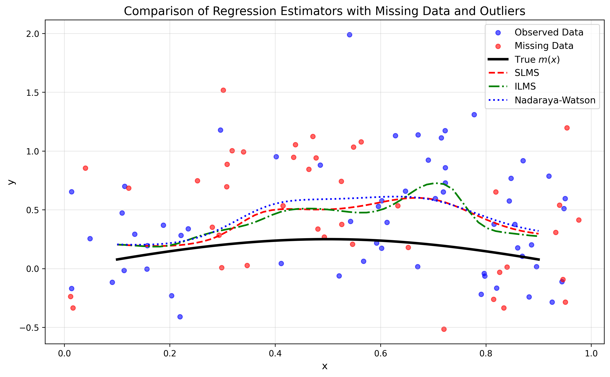

# Robust Nonparametric Regression for Missing Data
> **Implementation of SLMS and ILMS estimators for robust nonparmetric regression under MAR mechanism.**
> Based on my Master's thesis and the work of Boente et al. (2009).

## overview
two estimators are implemented:
- **SLMS**: uses only observed data with robust M-estimation.
- **ILMS**: Imputes missing values using SLMS, then re-smooths.

Designed to accutately estimate a regression function when:
- Data is **missing at random (MAR)**.
- the response variable contains **outliers (contamination)**.
- the relationship between variables is **nonlinerar**.
## methodology 
### SLMS (Simpligied Local M-Smother)
Uses only observed data with robust M-estimation and kernel weight to resist outliers.

### ILMS (Imputed Local M-Smother)
First, imputes missing responses using SLMS, then applies a second robust smoother on the completed dataset.

Both methods are consistent and asymptotically normal under MAR and contamination.

## Simulation Design

The simulation will reproduce the setup from chapter 4 of my thesis:
- $ y_i = 0.25 \sin(\pi x_i) + \epsilon_i $
- $ \epsilion_i $: mixture of $ \mathcal{N}(0, \sigma^2) $ and $ \mathcal{N}(0, 25\sigma^2) $
- missingness mechanism: $ p(x) = 0.3 + 0.5 \sin^2(5(x + 0.2)) $ (MAR)

Performance will be evaluated using **MISE** (Mean Integrated Squared Error) at contamination levels $ \eta = 0\%, 10\%, 20\%$.

## References
- **Affane, I. (2024)**.
  *Estimation non paramétique robuste de la régression pour des données manquantes*.
  [Download thesis (PDF).](<docs/Estimation non paramétrique robuste de la régression pour des données manquantes.pdf>)

- **Boente, G., González-Manteiga, w., & perez-González, A. (2009)**.
  *Robust nonparametric estimation with missing data*.
  Journal of Statistical Planning and Inference, 139(2), 571-592.
  [DOI:10.1016/j.jspi.2008.02.019](https://doi.org/10.1016/j.jspi.2008.02.019)

### 📁 Project Structure
```text
📦 Robust-nonparametric-estimation-of-regression-for-missing-data
├── 📂 src/                 # Core Python modules
│   ├── __init__.py
│   ├── slms.py             # SLMS robust estimator
│   ├── ilms.py             # ILMS robust estimator
│   └── data_simulation.py  # MAR mechanism & data generation
├── 📂 notebooks/           # Jupyter workflows & simulations
│   └── full_simulation.ipynb
├── 📂 results/             # Output figures & MISE tables
├── 📜 requirements.txt     # Python dependencies
├── 📜 README.md            # Project documentation
└── 📜 thesis_reference.pdf # Boente et al. (2009) citation
```text
## 💼 Business Applications & Real-World Use Cases

This robust nonparametric regression framework is designed to handle two common challenges in real-world  **missing values under MAR mechanism** and **outlier contamination**. Below are practical scenarios where this approach adds immediate value:

| Industry | Use Case | Business Impact |
|----------|----------|----------------|
| 🏥 **Healthcare & Epidemiology** | Modeling patient outcomes when lab results are missing or corrupted | Enables reliable risk stratification without discarding incomplete records — critical for resource-limited settings |
| 💳 **Financial Risk Modeling** | Credit scoring or fraud detection with noisy, incomplete transaction data | Reduces false positives/negatives by using robust estimators less sensitive to extreme values |
| 🛒 **E-Commerce & Marketing** | Customer lifetime value prediction with partial behavioral data | Improves targeting accuracy by leveraging all available signals, even when some features are missing |
| 📊 **Survey Research & Public Policy** | Analyzing socioeconomic indicators from surveys with non-response bias | Produces more representative estimates for policy decisions by accounting for MAR mechanisms |
| 🏭 **Industrial Quality Control** | Predicting equipment failure from sensor data with dropouts or anomalies | Supports proactive maintenance decisions despite imperfect data streams |

### 🔑 Why This Matters for Data Teams

## 💼 التطبيقات العملية وحالات الاستخدام الواقعية

صُمم هذا الإطار الإحصائي القوي لمعالجة تحديين شائعين في البيانات الواقعية: **القيم المفقودة وفق آلية MAR** و**وجود قيم شاذة**. فيما يلي سيناريوهات عملية يضيف فيها هذا النهج قيمة فورية:

| القطاع | حالة الاستخدام | الأثر التجاري |
|--------|---------------|--------------|
| 🏥 **الرعاية الصحية** | نمذجة نتائج المرضى عند وجود فحوصات مخبرية ناقصة | تمكين تقييم المخاطر بشكل موثوق دون حذف السجلات غير المكتملة |
| 💳 **النمذجة المالية** | تقييم الجدارة الائتمانية مع بيانات معاملات ناقصة أو ضوضائية | تقليل الأخطاء في الكشف عن الاحتيال باستخدام مقدرات مقاومة للقيم المتطرفة |
| 🛒 **التجارة الإلكترونية** | التنبؤ بالقيمة الدائمة للعميل مع بيانات سلوكية جزئية | تحسين دقة الاستهداف التسويقي بالاستفادة من كل الإشارات المتاحة |
| 📊 **الاستطلاعات والسياسات العامة** | تحليل مؤشرات اجتماعية-اقتصادية من استبيانات فيها عدم استجابة | إنتاج تقديرات أكثر تمثيلاً لدعم قرارات السياسات العامة |
| 🏭 **مراقبة الجودة الصناعية** | التنبؤ بأعطال المعدات من بيانات أجهزة استشعار فيها انقطاع أو شذوذ | دعم قرارات الصيانة الوقائية رغم عدم كمال جودة البيانات |

### 🔑 لماذا يهم هذا فرق البيانات؟


## Results

After 200 replications, the Mean Integrated Squared Error (MISE) is:

| Estimator | MISE |
|---------|------|
| SLMS | 0.0171 |
| ILMS | 0.0203 |
| Nadaraya-Watson | 0.0429 |

> **Robust estimators (SLMS/ILMS) outperform the classical Nadaraya-Watson under contamination and MAR.**
> **SLMS achieves the best performance.**




### 🚀 Quick Integration Example

```python
# After installing requirements:
from src.slms import SLMS
from src.data_simulation import generate_mar_data

# Generate or load your data (with missing values)
X, Y, mask = generate_mar_data(n=200, missing_rate=0.3, contamination=0.1)

# Fit the robust estimator
model = SLMS(bandwidth=0.3)
model.fit(X, Y, mask)

# Predict on new data
predictions = model.predict(X_new)